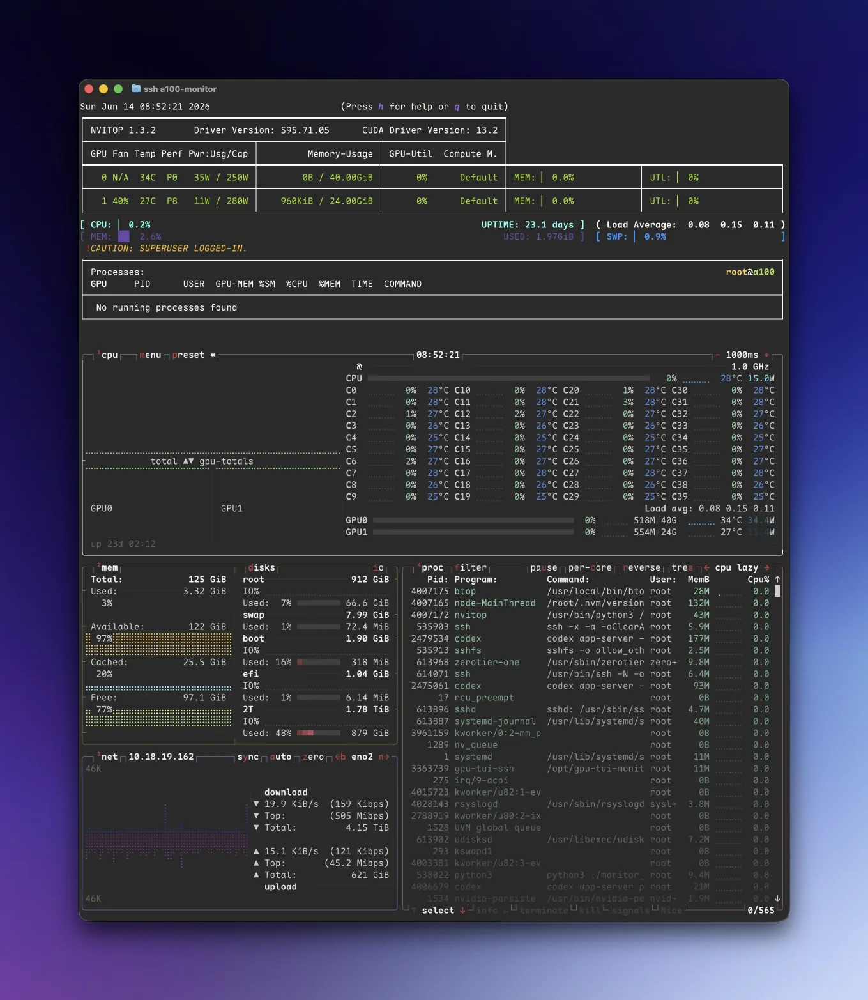

# gpu-ssh-monitor

Read-only GPU/server monitor over SSH. Users connect with a terminal and see a
fixed-size TUI dashboard composed from `nvitop` and `btop`.



## Features

- SSH entrypoint powered by Wish
- 130 columns x 69 rows by default
- top 21 rows: `nvitop`
- bottom 48 rows: `btop`
- concurrent SSH sessions share one dashboard source
- stdin is only used for monitor controls: `r` redraws the current client,
  `q` or `Ctrl-C` exits; it is not forwarded to `nvitop` or `btop`
- no dashboard collector runs when nobody is connected
- color-preserving differential terminal updates to reduce flicker

## Requirements

- Go 1.25+
- Node.js
- `npm install` build prerequisites for `node-pty`
- `nvitop`
- `btop`

## Build

```bash
npm install
npm run build
```

This produces `./gpu-ssh-monitor`.

## Run

```bash
SSH_PORT=23234 ./gpu-ssh-monitor
```

Connect:

```bash
ssh -p 23234 monitor@host
```

The username is not used for authorization by default. Put the service behind
your normal network controls, firewall, or SSH reverse proxy as appropriate.

## Configuration

- `SSH_HOST` default `0.0.0.0`
- `SSH_PORT` default `23234`
- `SSH_HOST_KEY_PATH` default `.ssh/gpu-ssh-monitor_ed25519`
- `DASHBOARD_CMD` default `NODE_CMD` or `node`
- `DASHBOARD_WORKDIR` default current working directory
- `DASHBOARD_SCRIPT` default `ssh-dashboard.cjs` inside `DASHBOARD_WORKDIR`
- `SSH_DASHBOARD_SOCKET` default `/tmp/gpu-ssh-monitor.sock`
- `SSH_SNAPSHOT_MS` default `SNAPSHOT_MS` or `500`
- `NVITOP_CMD` default `/usr/bin/nvitop`
- `BTOP_CMD` default `/usr/local/bin/btop`
- `NVITOP_ARGS` optional space-separated arguments
- `BTOP_ARGS` optional space-separated arguments
- `COLS` default `130`
- `NVITOP_ROWS` default `21`
- `BTOP_ROWS` default `48`
- `PANE_CWD` default `$HOME`

## systemd

Copy and adjust the sample unit:

```bash
sudo cp deploy/gpu-ssh-monitor.service /etc/systemd/system/gpu-ssh-monitor.service
sudo systemctl daemon-reload
sudo systemctl enable --now gpu-ssh-monitor.service
```

The sample assumes the repository is installed at `/opt/gpu-ssh-monitor` and
the binary is `/opt/gpu-ssh-monitor/gpu-ssh-monitor`.
